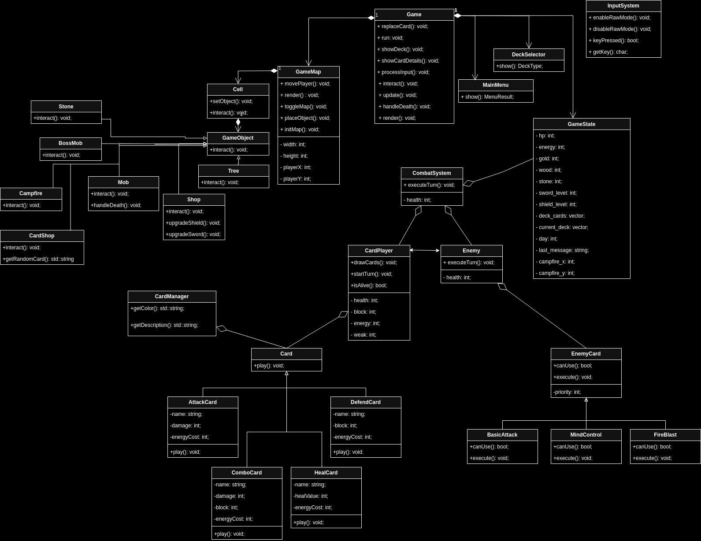

Class Diagram Overview

This UML diagram represents a card-based RPG game architecture with the following key components:
1. Core Game Entities

    GameState: Central data holder tracking HP, energy, resources (gold/wood/stone), day cycle, deck/card collections, and player position.

    CardPlayer: Player entity with health, energy, block mechanics, and card deck/hand management.

    Enemy: Opponent with health pool and AI-driven card execution logic (EnemyCard).

2. Card System

    Abstract Classes:

        Card (base for player cards like Strike, Defend)

        EnemyCard (base for enemy actions like FireBlast, MindControl)

    Card Manager:

        CardManager: Utility class handling card metadata (colors/descriptions).

3. Game World Objects

    GameObject hierarchy:

        Mob: Standard enemy (damage/reward logic)

        BossMob: Special enemy with sword-level gate

        Shop/CardShop: Resource/card acquisition systems

        Campfire: Rest/heal mechanics

4. Combat System

    CombatSystem: Mediates turn-based battles between CardPlayer and Enemy, handling card plays and status effects.

5. UI & Control

    MainMenu/DeckSelector: Menu navigation systems

    GameMap: Grid-based world rendering and collision detection

    InputSystem: Raw terminal input handling

Key Relationships

    Card Interactions:

        CardPlayer ↔ Enemy (bidirectional damage/status effects)

        CombatSystem orchestrates card play between both entities

    Game State Dependencies:

        Game class coordinates GameState, GameMap, and UI systems

        Shop/CardShop modify GameState resources/card collections

    Inheritance:

        Strike/Defend → Card

        Mob/BossMob → GameObject

    Patterns:

        MVC-like Structure: GameState (Model), Game/CombatSystem (Controller), GameMap/Menus (View)

        Strategy Pattern: Enemy AI via EnemyCard implementations

Notable Omissions

    Texture/visual asset handling

    Sound system integration

    Network multiplayer components

This architecture emphasizes modularity, with clear separation between game logic (CardPlayer/Enemy), data management (GameState), and UI layers. The card-driven combat system and resource economy form the core gameplay loop, while the map/object system enables exploration mechanics.
