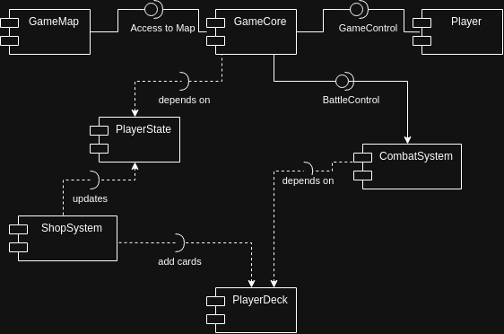

# Component Diagram  

## Overview  
This diagram illustrates the high-level architecture of the game, focusing on the interaction between major components.  
The system is designed to be modular, ensuring separation of concerns and ease of future expansion.  

1. Core Components

    GameCore
    Central hub coordinating game logic and systems.

        Key Relationships:

            Receives input via GameControl.

            Manages GameMap through the "Access to Map" interface.

            Coordinates with CombatSystem and PlayerState.

    GameMap
    Handles map data and spatial interactions.

        Interface: Provides "Access to Map" to GameCore.

2. Player-Related Modules

    Player
    Represents the player entity.

        Connection: Linked to GameControl for input handling.

    PlayerState
    Tracks player status (health, inventory, etc.).

        Dependencies:

            Updates ShopSystem (e.g., currency, item unlocks).

            Informs GameCore about state changes.

    PlayerDeck
    Manages player’s cards/abilities (likely for combat or progression).

        Relationships:

            Receives new cards via ShopSystem ("add cards").

            Depends on GameCore for integration into gameplay.

3. Systems

    CombatSystem
    Handles battle mechanics (damage, abilities, enemy AI).

        Key Links:

            Depends on BattleControl for combat flow.

            Feeds results back to GameCore.

    ShopSystem
    Manages in-game purchases and upgrades.

        Dependencies:

            Uses PlayerState to validate transactions.

            Sends new items/cards to PlayerDeck.

    GameControl
    Processes player input and relays it to GameCore.

        Role: Acts as a bridge between Player actions and core logic.

4. Interfaces & Dependencies

    Interfaces:

        Provided Interfaces (e.g., GameMap → GameCore): Define services a module offers.

        Required Interfaces (e.g., CombatSystem → BattleControl): Specify dependencies on external systems.

    Dependency Patterns:

        Dashed arrows indicate weaker dependencies (e.g., PlayerState → ShopSystem).

        Solid arrows represent direct associations or data flow (e.g., Player → GameControl).

5. Key Interactions

    Player Input Flow:
    Player → GameControl → GameCore → (affects GameMap, CombatSystem).

    Combat Execution:
    CombatSystem ↔ BattleControl → Results modify PlayerState/GameCore.

    Shop Transactions:
    ShopSystem updates PlayerDeck and PlayerState based on purchases.

6. Design Principles

    Modularity: Clear separation of concerns (e.g., GameMap for spatial logic, CombatSystem for battles).

    Loose Coupling: Interfaces (Access to Map, BattleControl) decouple systems.

    Central Coordination: GameCore orchestrates interactions between subsystems.
