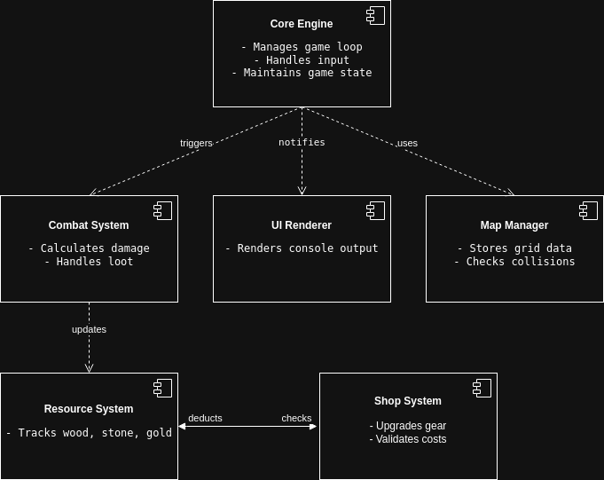

# Component Diagram  

## Overview  
This diagram illustrates the high-level architecture of the game, focusing on the interaction between major components.  
The system is designed to be modular, ensuring separation of concerns and ease of future expansion.  

  

---

## Components  

### 1. **Core Engine**  
- **Responsibility**:  
  - Manages the game loop (input processing, updates, rendering).  
  - Maintains global state: player stats, enemy positions, day counter.  
- **Key Interactions**:  
  - Uses **Map Manager** to validate movement and collisions.  
  - Triggers **Combat System** when the player encounters enemies.  
  - Notifies **UI Renderer** to update the console output.  

### 2. **Map Manager**  
- **Responsibility**:  
  - Stores the 20x20 grid-based map (hardcoded symbols: `T`, `M`, `B`, `#`).  
  - Handles collision detection (walls, impassable terrain).  
- **Key Data Structure**:  
  ```cpp  
  // Example map definition  
  char grid[20][20] = {  
    {'#', '.', 'T', 'M', ...},  
    // ...  
  };  

### 3. **Combat System**
- **Responsibility**:
  - Calculates damage using the formula: (Player Attack * Level) - Enemy Defense.
  - Handles loot distribution (gold from mobs, unique items from bosses).
  - Implements boss chase AI (5-tile radius).
- **Key Interactions**:
  - Updates Resource System with gold earned from defeated mobs.

### 4. Resource System
 - **Responsibility**:
  - Tracks player resources: wood, stone, gold.
  - Provides resource data to the Shop System for upgrades.
 - **UI Integration**:
        Pressing R displays resources via UI Renderer.

### 5. Shop System
 - **Responsibility**:
   - Handles gear upgrades (e.g., sword damage, armor defense).
   - Validates upgrade costs (e.g., "50 gold + 20 stone").
 - **Key Interactions**:
    Deducts resources via Resource System after purchases.

### 6. UI Renderer
 - **Responsibility**:
  - Renders the map, player stats, and menus in the console.
  - Uses ANSI escape codes for colored output (e.g., red for enemies).

## Component Interactions
### Scenario 1: **Player Movement**
    Core Engine receives W/A/S/D input.
    Map Manager checks if the target tile is walkable.
    If valid, Core Engine updates the player's position.
    UI Renderer redraws the map.

### Scenario 2: **Boss Fight**
    Core Engine detects player-boss proximity.
    Combat System initiates turn-based combat.
    On victory, Resource System grants a unique item.
    UI Renderer displays "Boss defeated! +1 Ruby Sword."

### Scenario 3: **Campfire Rest**
    Player interacts with a campfire (E key).
    Resource System deducts 5 wood.
    Core Engine resets player energy and increments the day counter.
    UI Renderer shows "Energy restored! Day 6."

## Notes
    All components are implemented in C++17 without external libraries.
    The map is hardcoded for simplicity but can be extended to file-based loading later.